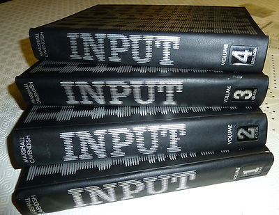

# Marshall-Cavendish-Input-Spectrum

Project based on Marshall Cavendish Input magazine implementations using Fuse Emulator

Each folder contains a list of Spectrum .tap files inspired by the exercise in the Input magazine.

Each .tap file has been saved using "fuse" spectrum emulator.

## Loading tapes

You will be required to use a spectrum emulator of choice.

1. Load file.
2. type LOAD ""

Note that some files are examples data files used as loading/saving data only

## Running tapes

1. Load tape as show above
2. type RUN

## Volume 1 

The following programs are based on programs from Volume 1 Input editions

[No 1](vol1/No01/readme.md) 
[No 2](vol1/No02/readme.md)