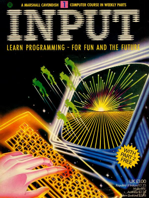

## Volume 1

### No 1

#### Contents

+ Basic Programming 1
  + Think of a number 
    The RND function. IF...THEN. variables. INPUT

+ Machine Code 1
  + Speed your games routines 
  Some strinking graphics to introsuce machine code

+ Basic Programming 2
  + The art of the FOR...NEST Loop 
  Use the computer as a counting device and how it's used

+ Peripherals
  + Untangling your save and loads 
  How to load and save data 

#### Program File Summary

1. Think of a number - My first BASIC program to think of a number and print out whether it's higher or lower and the number of tries when guessed right.

2. Times tables - Random multiplication in the 12 times table. Keep guessing until you get it right. 

3. Machine Code - You must load this before you can run program 4 - 6. Creates a 3 x 3 DAT UDG grid for graphics.

4. Moving Grid - Creates a grid of 9 characters that you can move with q - up, a - down, o - left, p - right.

5. Tank - Creates a Tank using DATA UDG and adds another two UDG grids to fire the cannon. Move using q - up, a - down, o - left, p - right.

6. Frog - Creates a Frog using the 3 x 3 UDG grid and bounces along the screen when a key is pressed.

7. For Loop - First For Loop

8. For Loop Beep - Create a for loop that beeps from low to high pitch.

9. For Loop Colours 01 - Creates random blocks of colour on the screen

10. For Loop Colours 02 - Creates blocks of colour on the screen in an ordered fashion.

11. For Loop Sunset - Creates a Sunset effect.

12. For Loop Embroidery - Creates an Embroidery effect on the screen.

13. For Loop Creepy Crawly - Makes a basic creepy crawly appear to move.

14. Dancer - Creates a dancer using the graphics and it appears to dance.

15. Creepy Crawly Move - Makes a basic creepy crawly move across the screen.

