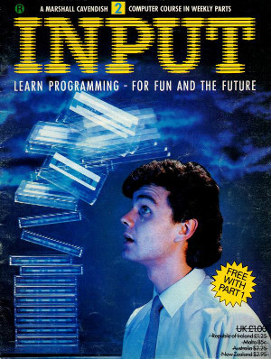

## Volume 1

### No 2

1. Average Marks - Adds together inputted numbers and divide by the number of entries.

2. Think of a number - enter a number and tells you whether the guess is too low or too high. If correct asks you for another go. 

3. Fruit Machine - Start with a number of coins. Roll three random numbers. If sequence of numbers match (2 match or all 3 match), then win money. Matching 3 wins the jackpot. Keep trying until you run out of coins.

4. Fir Tree - Simple program to output a fir tree.

5. Random Fir Tree - Outputs random fir trees over the screen.

6. Space Invader - Output Space Invader.

7. Ship - Output ship graphic

8. Files - Small program to enter records into program and save and load the data. Load data use the **data.tap**

9. Missile - Press fire and launch a missile

10. Missile 2 - Move missile launcher left (z) and right(x) and launch a missle when "f" is pressed.

11. Triangle - Work out the length of a side of a triangle using Pythagorean theorem.

12. Coin Toss - Toss a coin twice and show message if it's heads or tails.

13. Name - type in your name and show random greeting.

14. Dice Throw - Throw a dice and print whether throw one equals throw two.

