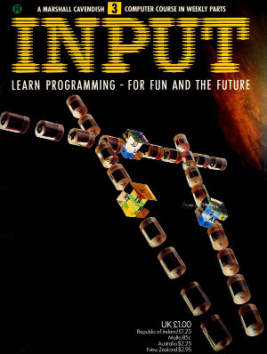

## Volume 1

### No 2

#### Contents

+ Machine Code 3
  + Get down to low-level languages 
    Learn why BASIC is limited for some jobs, and get to know machine code and assembly language

+ Games Programming 3
  + Fun to program maze games 
  Create your own maze on the screen, complete with travelling 'eater'

+ Applications 2
  + Streamline your hobbies 2 
  Now you've set up your data file, here's how to search it, amend or delete your records

+ Machine Code 4
  + Draw a fire breathing Dragon 
  Another useful character to add to your stock

+ BASIC programming 5
  + How to plot, draw, line and print 
  Get started on computer art

+ BASIC programming 6
  + Variable, the mystery explained 
  Learn to understand all those Xs and Ys

#### Program File Summary

1. Machine 1 - Demostrates the performance difference between BASIC and machine code execution.

2. Machine 2 - Using machine code to randomly output coloured blocks on the over the entire screen.

3. Fun little maze game that allows you to move an * around the screen to eat the dots. When all the dots have gone, the time take is displayed. Try again to beat you quickest time.

4. Example program to store records of data. Save and Load the data recorded. Search and move forwards and backwards through the data.

5. Graphics to display a Dragon on the screen that can be moved around using the keys "Q" up, "A" down, "O" left, "P" right and "SPACE" makes the Dragon breath fire! Note that you must load and run machinegrip.tap as a pre-requisite. 

6. Demonstrates how to draw lines and draws a red spiral on the screen.

7. Demonstrates how to draw lines. Draws the outline and roof of a 3D house. Feel free to add windows, doos etc..

8. Demonstrates a fuel pumping station. Select "D" Diesel, "U" Unleaded, "S" Super Unleaded. Press "n" to pump the fuel and watch the price increase. Just like real life.. but free.

