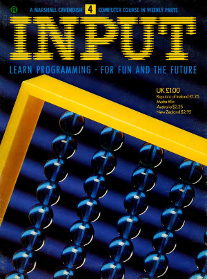

## Volume 1

### No 4

#### Contents

+ Games Programming 4
  + Scoring and timing routines 
    See how fast — and how good — you are. Plus a simple new game program

+ BASIC programming 7
  + All about read and data 
  How to give your computer a store of information, or operating instructions

+ Machine Code 5
  + Learning to count on one finger 
  Get to know binary arithmetic — the basis of the way computers count

+ BASIC programming 8
  + Spot on screen displays 
  Using punctuation and formatting commands for neater layout of printing on the screen

+ Applications 3
  + Multiple letters made easy 
  A text editing program to speed up repetitive letter writing — like job opplications

#### Program File Summary

1. Minefield - Move the tank '#' around to the screen to the 'O' using the keys "Q" up, "A" down, "O" left, "P" right. If you hit a mine.. BOOM!

2. Demonstrates access to the concept of a timer by simple Gun Draw game where pressing a key determines whether you survive or are shot. 

3. Simple program to lookup a telephone number from a cached telephone directory.

4. Demostates using DATA to load dat aapplicable to either old or new bridge rules.

5. Simple Program with add, subtract, multiple or divide two numbers together in a BASE from 2 to 36. The result is shown in both the chosen BASE and Decimal. For example BASE 16: 1A + 2B = 45, Decimal 26 + 43 = 69

6. Converts a number between 0 and 1 into binary, for example: 0.5 = 0.1 BASE 2

7. Demonstrates the use of PRINT TAB to display cricket scores instead of using PRINT AT.

8. Demonstrates using DATA for printing letter contents.