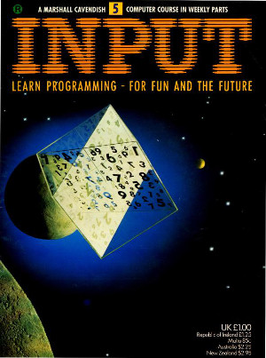

## Volume 1

### No 5

#### Contents

+ Basic Programming 9
  + what do I do next? 
    Different ways for you to give the computer instructions dunng the course of a program

+ Applications 4
  + Sort out your expenses 
  A simple accounting program to help you to keep track of your income and expenditure

+ Games Programming 5
  + Deadly enemies and aliens 
  In this new game, the techniques of enemies thot shoot back -and how to avoid getting hit

+ Machine code 6
  + Handling Hexidecimal arithmetic 
  Making it easier to cope with the way computers do their arithmetic

#### Program File Summary

1. Simple enter your name and output a greeting.

2. Demonstrate how to store 5 names and ages into 2 arrays and output the list.

3. Simple etch a sketch type program to draw a line using the keys "a" up, "z" down, "o" left and "p" right.

4. Simple program to guess the password. If it's correct, then print O.K

5. Expenses program to enter all your expenses and subtract them from your income. Load  demo july.tap data.