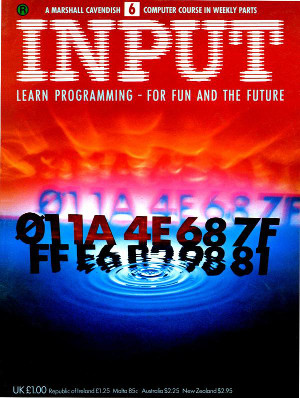

## Volume 1

### No 6

#### Contents

+ Games Programming
  + Creating the big bang 
    Game routines that can be added to a variety of games to create convincing explosions.

+ Basic Programming 12
  + Get your games in shape 
  Write better structured smoother running code: Part 1.

+ Machine Code 7
  + Getting down below zero 
 How to deal with negative numbers in hex and binary arithmetic.

+ Basic Programming 13
  + Refining your screen graphics 
  Getting to grips with more sophisticated uses of BASIC graphics commands.

#### Program File Summary

1. 